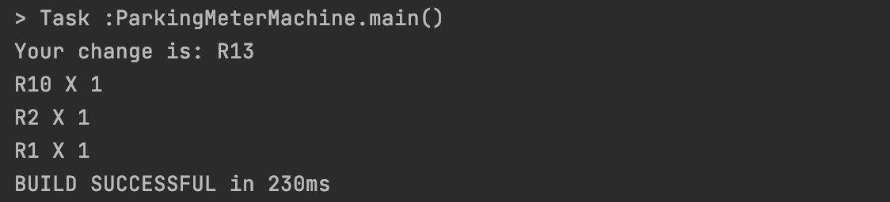

# ParkingMeter
A simple Kotlin application for calculating change from parking meter and returning the change in ZAR denomination.
The application also has unit tests which can be found under src/test/kotlin

We have the following denomination in the ZAR currency: {200, 100, 50, 20, 10, 5, 2, 1}

Please note:
`amountToDeduct` is the amount provided from the machine for the duration of parking 
`insertAmount` is the amount the user insert in the machine.

Here is an example of the output given the amountToDeduct is 7, and the user input is 20

